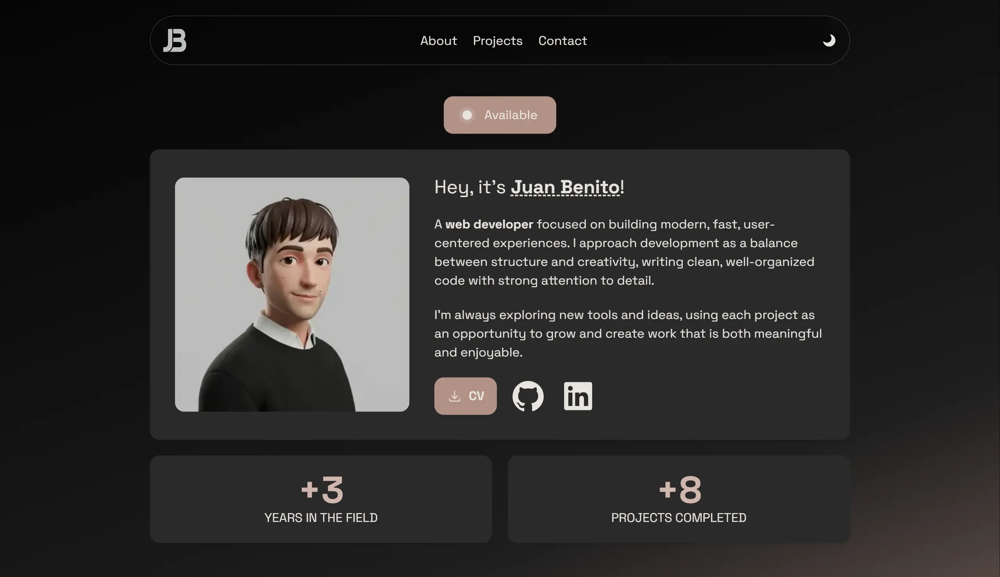

# Portfolio

My personal developer portfolio - a fast site built with the Next.js App Router, showcasing my featured projects and a working contact form with server-side validation and rate limiting.

**Live**: https://juanbenito.vercel.app

## Features

- **Light / dark theme** — system-aware, toggleable, persisted via `next-themes`.
- **Contact form** — React Server Action with end-to-end type safety, server-side validation (Zod), IP-based rate limiting (Upstash Redis), and email delivery over SMTP (Brevo + Nodemailer).
- **Accessible & motion-aware** — `aria-live` status regions and a `prefers-reduced-motion` fallback for animations.
- **Optimized media** — `next/image`, WebP images, and poster frames for project videos.
- **SEO / social** — per-page metadata and Open Graph images.

## Tech Stack

- **Framework:** Next.js 16 (App Router) · React 19
- **Language:** TypeScript
- **Styling:** Tailwind CSS 4
- **Animation:** Motion
- **Validation:** Zod
- **Rate limiting:** Upstash Ratelimit + Redis
- **Email:** Nodemailer (Brevo SMTP relay)
- **Tooling:** ESLint · Prettier · pnpm
